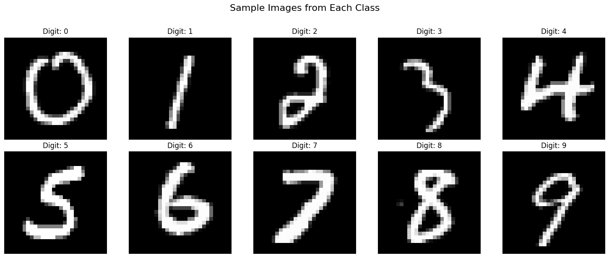
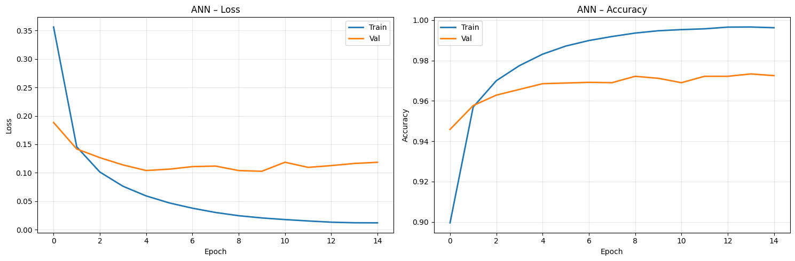
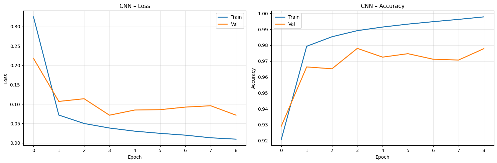
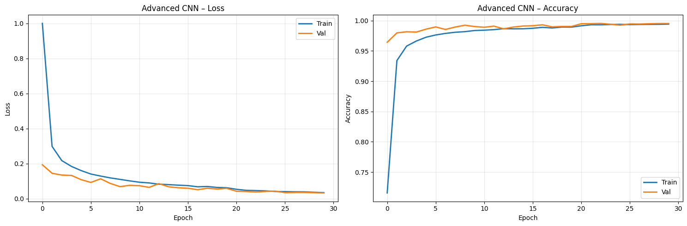
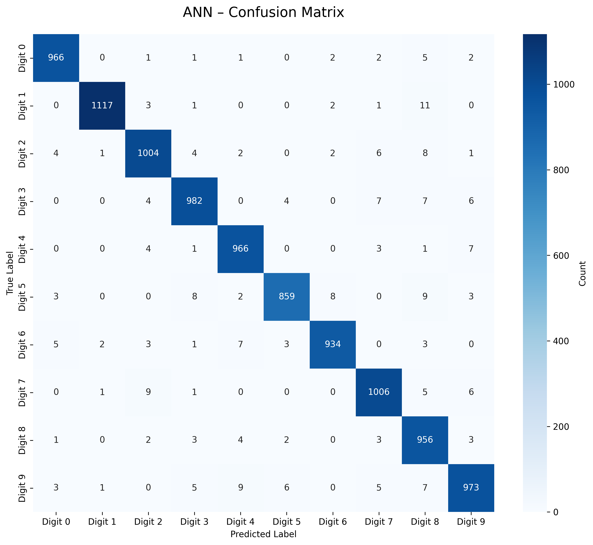
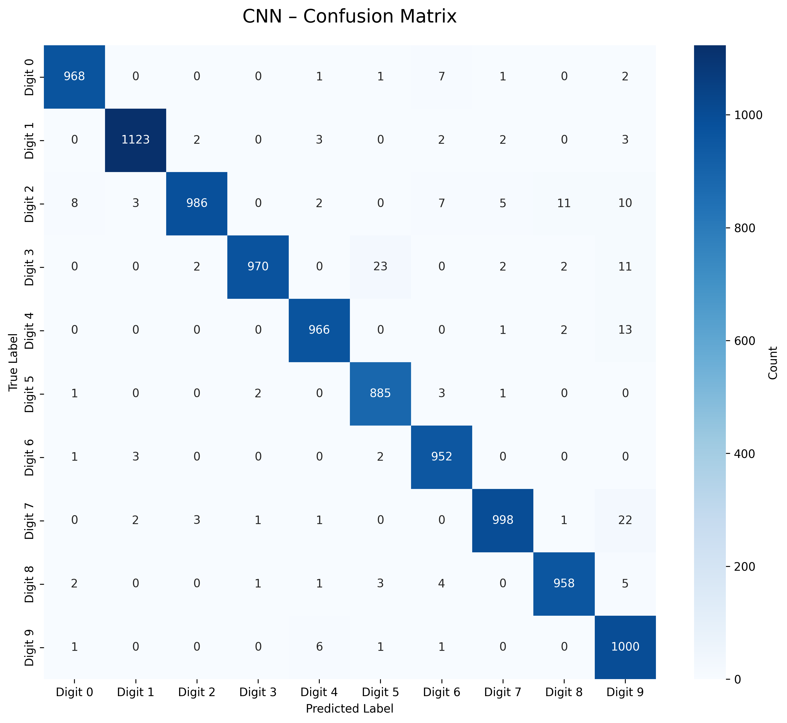
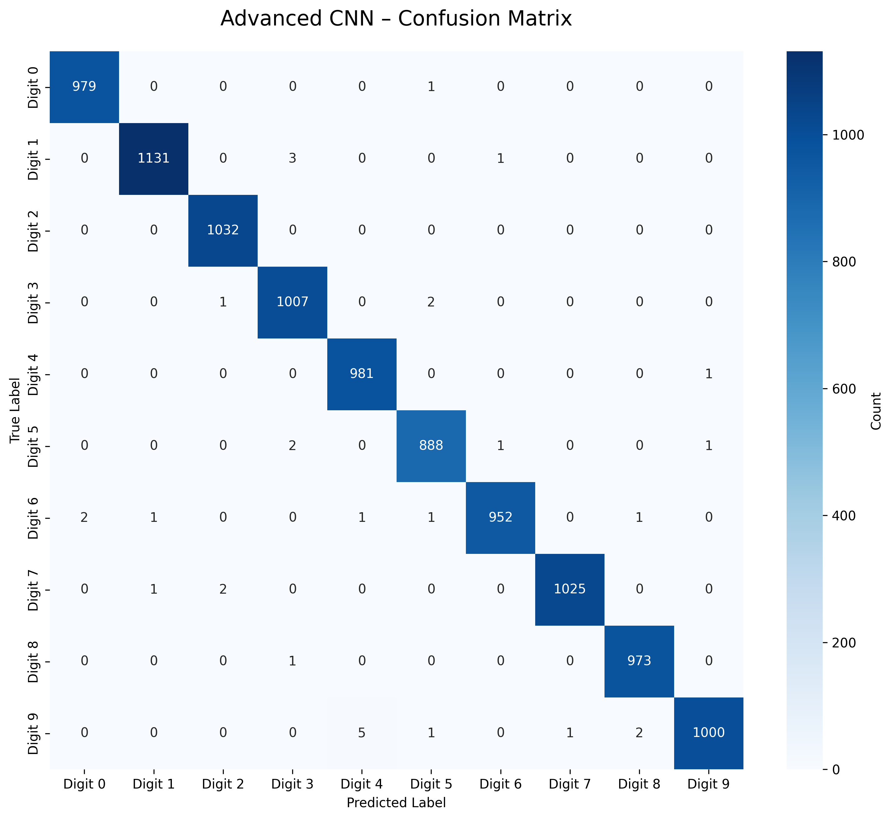
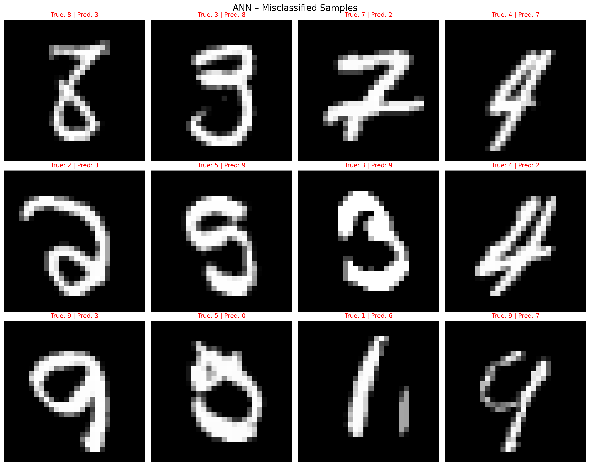
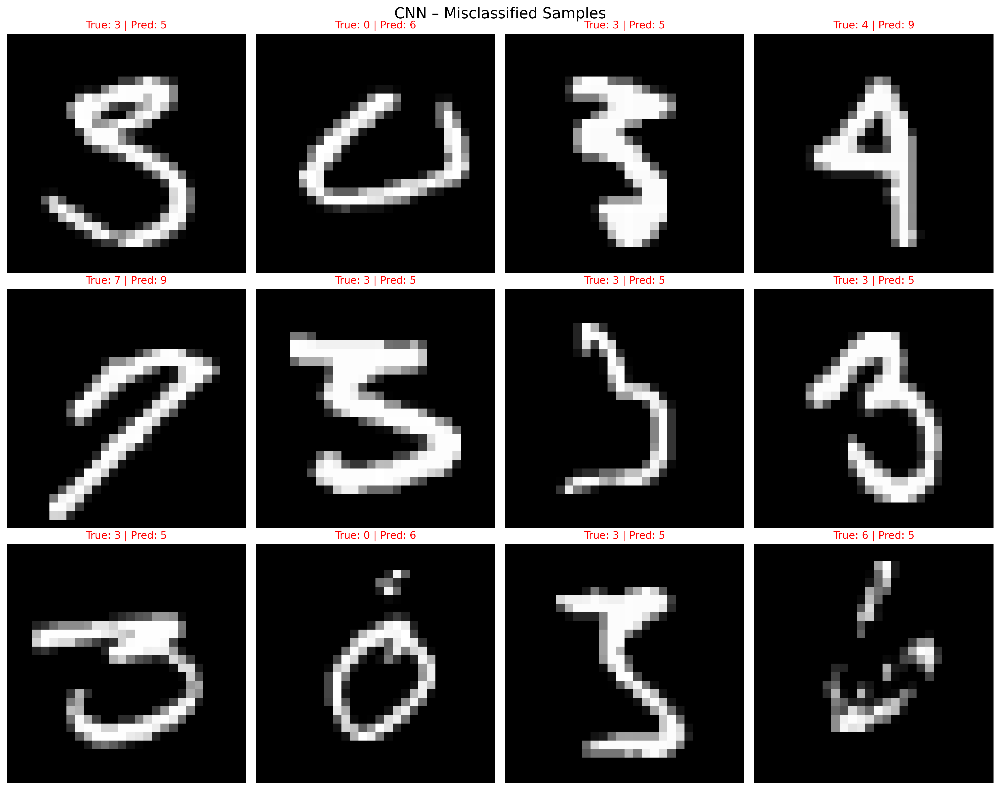
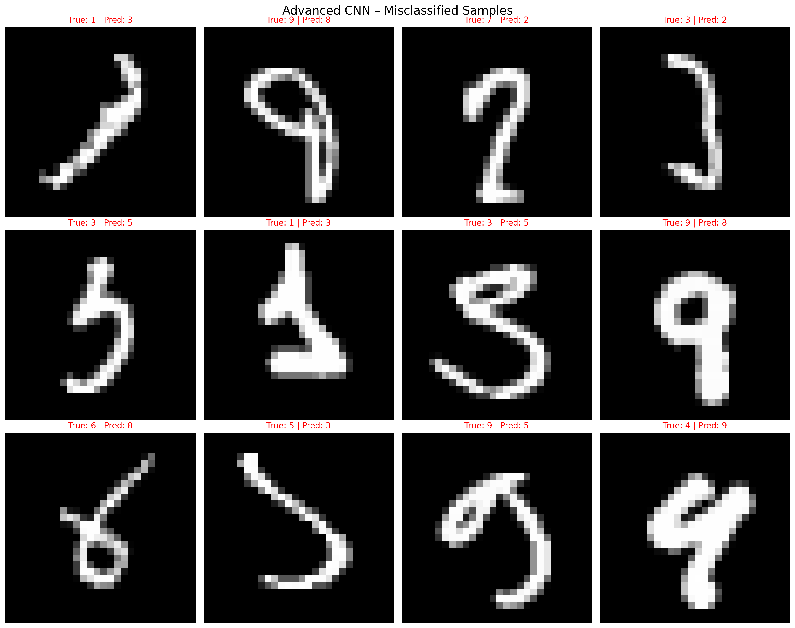

# MNIST Digit Classification — ANN vs CNN vs Advanced CNN

A structured comparison of three neural network architectures on the MNIST handwritten digit dataset, built with TensorFlow/Keras. The project progresses from a simple fully-connected ANN to a regularized, augmentation-equipped Advanced CNN, with thorough evaluation and visualization at each stage.

---

## Table of Contents

- [Project Overview](#project-overview)
- [Repository Structure](#repository-structure)
- [Dataset](#dataset)
- [Models](#models)
- [Training Configuration](#training-configuration)
- [Results](#results)
- [Visualizations](#visualizations)
- [Requirements](#requirements)
- [How to Run](#how-to-run)

---

## Project Overview

The goal of this project is to benchmark three progressively complex architectures on MNIST digit classification (10 classes, digits 0–9):

| Model         | Architecture Type          | Key Features                                      |
|---------------|----------------------------|---------------------------------------------------|
| ANN           | Fully Connected            | 2 hidden layers (128 → 64), ReLU, Softmax         |
| CNN           | Convolutional              | 3 Conv-BN-ReLU blocks, GlobalAvgPooling           |
| Advanced CNN  | Deep CNN + Regularization  | Dual Conv blocks, Dropout, L2, in-model augment.  |

All models use the **Adam optimizer** and **sparse categorical cross-entropy loss**, with early stopping and model checkpointing.

Global random seed: `21` (Python, NumPy, TensorFlow)

---

## Repository Structure

```
├── MNIST.ipynb                        # Main notebook
├── helper_mnist.py                    # Utility functions (downloaded from GitHub)
│
├── models/
│   ├── best_ann_model.keras
│   ├── best_cnn_model.keras
│   └── best_advanced_cnn.keras
│
├── training_logs/
│   ├── ann_training_history.csv
│   ├── cnn_training_history.csv
│   └── advanced_cnn_training_history.csv
│
├── plots/
│   ├── ann_confusion_matrix.png
│   ├── cnn_confusion_matrix.png
│   ├── advanced_cnn_confusion_matrix.png
│   ├── ann_misclassifications.png
│   ├── cnn_misclassifications.png
│   └── advanced_cnn_misclassifications.png
│
└── README.md
```

---

## Dataset

**MNIST** — loaded directly via `keras.datasets.mnist`.

| Split      | Samples |
|------------|---------|
| Train      | 54,000  |
| Validation | 6,000   |
| Test       | 10,000  |

- Validation split: 10% stratified from training data
- Pixel values normalized to `[0, 1]`
- ANN input: flattened `(batch, 784)`
- CNN input: `(batch, 28, 28, 1)`

### Sample Digits


> *Sample images from each of the 10 digit classes (0–9)*

---

## Models

### 1. ANN — Artificial Neural Network

```
Input (784)
  └── Dense(128, relu, he_normal)
  └── Dense(64, relu, he_normal)
  └── Dense(10, softmax)
```

- No regularization or dropout
- Serves as the baseline

---

### 2. CNN — Simple Convolutional Neural Network

Reusable `conv_block(filters)` = `Conv2D → BatchNorm → ReLU`

```
Input (28, 28, 1)
  └── conv_block(32) → MaxPool
  └── conv_block(64) → MaxPool
  └── conv_block(128) → GlobalAvgPool
  └── Dense(128, relu)
  └── Dense(10, softmax)
```

- Adds spatial feature extraction over ANN
- `ReduceLROnPlateau` callback included

---

### 3. Advanced CNN

```
Input (28, 28, 1)
  └── [Data Augmentation: RandomRotation, RandomTranslation, RandomZoom]
  └── conv_block(32) × 2 → MaxPool → Dropout(0.25)
  └── conv_block(64) × 2 → MaxPool → Dropout(0.25)
  └── conv_block(128) × 2 → MaxPool → Dropout(0.25)
  └── Flatten
  └── Dense(256, relu, L2) → BatchNorm → Dropout(0.5)
  └── Dense(128, relu, L2) → BatchNorm → Dropout(0.5)
  └── Dense(10, softmax)
```

- In-model augmentation (active only during training)
- L2 weight decay: `1e-4`
- Aggressive dropout for generalization
- `EarlyStopping` patience: 7 epochs

---

## Training Configuration

| Parameter                   | ANN     | CNN     | Advanced CNN |
|-----------------------------|---------|---------|--------------|
| Batch Size                  | 128     | 128     | 64           |
| Max Epochs                  | 15      | 20      | 30           |
| Learning Rate               | 0.001   | 0.001   | 0.0005       |
| Early Stopping Patience     | 5       | 5       | 7            |
| ReduceLROnPlateau           | ✗       | ✓       | ✓            |
| Data Augmentation           | ✗       | ✗       | ✓            |
| Dropout                     | ✗       | ✗       | ✓            |
| L2 Regularization           | ✗       | ✗       | ✓            |

**Augmentation parameters (Advanced CNN):**
- Rotation: ±10° (`10/360` fraction of full rotation)
- Width/Height shift: ±10%
- Zoom: ±10%

---

## Results

### Test Set Performance

| Model        | Test Accuracy | Test Loss | Weighted F1 |
|--------------|---------------|-----------|-------------|
| ANN          | 97.63%        | 0.0872    | 0.9763      |
| CNN          | 98.06%        | 0.0678    | 0.9806      |
| Advanced CNN | 99.68%        | 0.0278    | 0.9968      |

### Per-Class Accuracy

| Digit | ANN    | CNN    | Advanced CNN |
|-------|--------|--------|--------------|
| 0     | 98.57% | 98.78% | 99.90%       |
| 1     | 98.41% | 98.94% | 99.65%       |
| 2     | 97.29% | 95.54% | 100.00%      |
| 3     | 97.23% | 96.04% | 99.70%       |
| 4     | 98.37% | 98.37% | 99.90%       |
| 5     | 96.30% | 99.22% | 99.55%       |
| 6     | 97.49% | 99.37% | 99.37%       |
| 7     | 97.86% | 97.08% | 99.71%       |
| 8     | 98.15% | 98.36% | 99.90%       |
| 9     | 96.43% | 99.11% | 99.11%       |

### Misclassification Rates

| Model        | Errors / 10,000 | Error Rate |
|--------------|-----------------|------------|
| ANN          | 237             | 2.37%      |
| CNN          | 194             | 1.94%      |
| Advanced CNN | 32              | 0.32%      |

---

## Visualizations

### Training Curves

#### ANN — Loss & Accuracy


#### CNN — Loss & Accuracy


#### Advanced CNN — Loss & Accuracy


---

### Confusion Matrices

#### ANN


#### CNN


#### Advanced CNN


---

### Misclassified Samples

#### ANN


#### CNN


#### Advanced CNN


---

## Requirements

```
tensorflow >= 2.x
numpy
pandas
matplotlib
seaborn
scikit-learn
scipy
```

Install with:

```bash
pip install tensorflow numpy pandas matplotlib seaborn scikit-learn scipy
```

---

## How to Run

1. Clone the repository and open the notebook:
   ```bash
   git clone <repo-url>
   cd <repo-folder>
   jupyter notebook MNIST.ipynb
   ```

2. Run all cells in order. The notebook is organized into self-contained sections:
   - **Section 1** — Setup & configuration
   - **Section 2** — Data loading & preprocessing
   - **Section 3** — ANN training & evaluation
   - **Section 4** — CNN training & evaluation
   - **Section 5** — Advanced CNN training & evaluation
   - **Section 6** — Final model comparison

3. `helper_mnist.py` is automatically downloaded from GitHub at the start of the notebook — no manual setup needed.

4. Trained models will be saved as `.keras` files, training logs as `.csv`, and all plots as `.png` in the working directory.

> The notebook was developed on Google Colab with a **T4 GPU**. GPU acceleration is recommended for the Advanced CNN due to its depth and 30-epoch budget.
